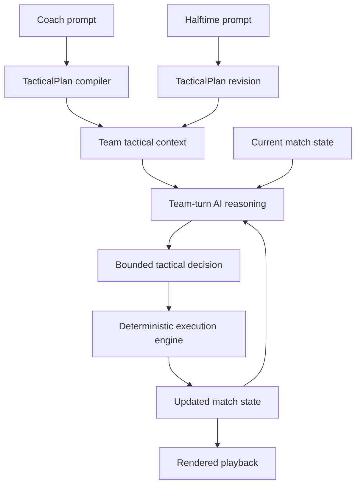

# Plan tactics-duel AI reasoning pivot

## Summary

Rework the current `tactics-master` vertical slice so live team-turn AI reasoning becomes the main source of tactical behavior during a match, while the deterministic engine remains the bounded execution and playback layer. The plan preserves the same-device 5v5 duel, halftime reset, and continuous shared-screen presentation, but replaces the current prompt-to-bias shortcut as the primary product path.

---

## Problem Frame

The current prototype proves the shared-device loop, basic field presentation, and a deterministic football abstraction, but it does not yet satisfy the real product bet. Right now, prompt meaning is mostly collapsed into handcrafted tactical weights in `src/domain/tactics/interpreter.ts`, which makes the match feel like a tuned simulation with text flavoring rather than AI-driven tactical play.

That mismatch matters because the product strategy explicitly leans on natural-language coaching as the differentiator. If the core behavior continues to come from fixed keyword mapping, the codebase will drift toward the wrong architecture: more tuning and more parser logic instead of better tactical reasoning. The plan therefore needs to pivot the live behavior source now, before more game logic accumulates around the placeholder interpreter.

---

## Requirements

**Product loop preservation**

- R1. The implementation must preserve the current same-device hot-seat flow: opening prompts, first half, halftime prompts, second half, result, and rematch.
- R2. The implementation must preserve the 2-to-3-minute shared-screen match shape from the brainstorm rather than expanding into a slower or more management-heavy loop.
- R3. The implementation must keep the existing deterministic playback layer readable and continuous on screen.

**AI-driven tactical behavior**

- R4. Team-turn AI reasoning must become the primary source of live tactical decisions during a match, replacing the current prompt-to-bias shortcut as the main product path.
- R5. The system must turn each coach prompt into durable tactical context that team-turn reasoning can use across the match and revise at halftime.
- R6. AI reasoning must happen at bounded team decision windows rather than per-player independent reasoning or per-tick unconstrained model calls.
- R7. Team-turn AI output must resolve into the existing football-core action space: move, pass, shoot, dribble or carry, make a run, mark, press, intercept, and clear.
- R8. The deterministic engine must remain responsible for legality, state progression, pacing, and final execution of the chosen tactical intent.

**Legibility, safety, and fallback**

- R9. The match must remain attributable enough that players can plausibly connect visible behavior back to the prompts and halftime changes they entered.
- R10. Live AI reasoning must be constrained enough to preserve match speed, coherence, and debuggability on a shared screen.
- R11. The system must define fallback behavior for failed, malformed, slow, or off-shape model output without collapsing the match loop.
- R12. The architecture must keep a clean seam between prompt input, tactical-plan context, team-turn reasoning, and deterministic execution so future changes do not require rewriting the whole game loop.

---

## Key Technical Decisions

- KTD1. **Promote AI to the team-turn layer, not the renderer or raw simulation core.** The current React shell, match playback, and core state progression are usable. The pivot should happen at the tactical-decision layer, where live AI authorship actually changes what the teams attempt.
- KTD2. **Introduce an explicit `TacticalPlan` contract.** Raw prompts should no longer leak straight into the simulation or be collapsed directly into one weighted object. A structured tactical-plan layer must carry stable coaching intent, priorities, constraints, and revision points into team-turn reasoning.
- KTD3. **Use team-turn reasoning instead of per-player independent reasoning for v1.** Team-turn AI can still produce genuine tactical authorship while preserving coherence, speed, and explainability. Per-player reasoning is deferred because it multiplies latency, cost, and debugging difficulty too early.
- KTD4. **Keep deterministic execution as the arbiter of legality and pace.** AI should decide what the team tries next; deterministic code should decide how that intent maps onto the bounded football simulation, which players carry it out, and how the state advances on screen.
- KTD5. **Treat the current keyword interpreter as fallback and test fixture infrastructure, not the product architecture.** It remains useful as a resilient no-model path and for acceptance fixtures, but future behavior should not accrete around it.
- KTD6. **Bound AI reasoning to explicit decision windows.** Model invocation should happen at tactically meaningful moments such as possession resets, pressure transitions, final-third setups, or halftime resumption, not continuously every simulation tick.

---

## High-Level Technical Design

The updated architecture has five cooperating layers:

1. `App shell` for prompt entry, halftime revision, playback, and result flow.
2. `TacticalPlan` compilation for turning each coach prompt into persistent team context plus halftime deltas.
3. `Team-turn AI reasoning` for choosing the next bounded tactical intention under current state and tactical plan.
4. `Deterministic execution engine` for mapping that intention into legal football actions, movement, state updates, and scoring.
5. `Presentation layer` for continuous-looking playback and match legibility.



The key architectural seam is:

`prompt -> TacticalPlan -> team-turn AI decision -> deterministic execution -> rendered match state`

That seam is the whole point of the pivot. It keeps “real AI tactical authorship” isolated from “football legality and playback,” which makes future expansion possible without turning the core engine into opaque prompt glue.

The current code already contains a useful version of the last two stages. The main work is to insert the missing middle: a durable tactical-plan layer plus a bounded team-turn reasoning layer that can operate repeatedly during play.

---

## System-Wide Impact

- The current `src/domain/tactics` package stops being the main live behavior source and becomes one provider in a broader tactical-planning boundary.
- The current `src/domain/match` package needs a new external input shape: not just “current tactical weights,” but team-turn tactical decisions emitted during play.
- `src/state/gameFlow.ts` becomes responsible for orchestrating AI-backed match progression and failure fallback, not just running a precomputed simulation.
- Acceptance coverage must expand from “prompt maps to readable bias” to “live AI reasoning stays bounded and attributable.”

---

## Implementation Units

### U1. Introduce the TacticalPlan boundary and migrate current prompt handling behind it

- **Goal:** Replace the implicit prompt-to-bias shortcut with an explicit `TacticalPlan` layer that becomes the stable contract between coach prompts and match-time reasoning.
- **Requirements:** R1, R5, R12. Supports the brainstorm’s prompt-vs-prompt identity and the need for best-effort interpretation without locking the architecture to the current parser.
- **Dependencies:** None.
- **Files:**
  - `src/domain/tactics/types.ts`
  - `src/domain/tactics/defaults.ts`
  - `src/domain/tactics/interpreter.ts`
  - `src/domain/tactics/plan.ts`
  - `src/domain/tactics/providers/keywordPlanProvider.ts`
  - `src/domain/tactics/providers/keywordPlanProvider.test.ts`
  - `src/state/gameFlow.ts`
- **Approach:** Define a `TacticalPlan` shape that can carry coach intent, style emphasis, decision priorities, risk posture, and halftime revisions in a way that both fallback and AI providers can produce. The current interpreter should be downgraded into a `keywordPlanProvider` implementation of that contract rather than being used directly by the simulation.
- **Patterns to follow:** Preserve the existing bounded tactical vocabulary where it is still useful for fallback and tests, but stop coupling match execution to `interpretPrompt()` output directly.
- **Test scenarios:**
  - A free-form opening prompt can be converted into a valid `TacticalPlan`.
  - A halftime prompt can revise or override the first-half plan without requiring a separate simulation model.
  - The fallback provider produces playable plans for vague or empty prompts.
  - Existing prompt-entry flow still functions after the plan boundary is inserted.
- **Verification:** `src/domain/tactics/providers/keywordPlanProvider.test.ts`, `src/App.test.tsx`

### U2. Add team-turn reasoning contracts and bounded decision windows

- **Goal:** Create the new live reasoning seam: define when team-turn AI is allowed to think, what state it sees, and what kind of bounded decision it is allowed to return.
- **Requirements:** R4, R6, R7, R10, R12. Covers the architecture shift from static prompt interpretation to live bounded tactical reasoning.
- **Dependencies:** U1.
- **Files:**
  - `src/domain/reasoning/types.ts`
  - `src/domain/reasoning/decisionWindows.ts`
  - `src/domain/reasoning/teamTurnContext.ts`
  - `src/domain/reasoning/teamDecisionSchema.ts`
  - `src/domain/reasoning/__tests__/decisionWindows.test.ts`
  - `src/domain/reasoning/__tests__/teamTurnContext.test.ts`
- **Approach:** Model live reasoning around explicit team decision windows such as possession resets, transition pressure, final-third setup, or defensive reorganization. Each window should produce a bounded “what is the team trying now?” output rather than free-form prose that the engine must guess at. This unit defines the contract, not the live provider yet.
- **Technical design:** Directionally, the reasoning output should read like a bounded tactical instruction set:
  ```text
  team objective
  target zone
  ball progression preference
  support-run instruction
  pressing or marking emphasis
  risk ceiling
  ```
  The exact representation is implementation-owned, but it must be stable enough for deterministic execution and tests.
- **Patterns to follow:** Mirror the separation already present in the match engine between selection and resolution; the AI layer should choose team intent, and the engine should execute it.
- **Test scenarios:**
  - The same match state consistently maps to the same decision window classification.
  - Final-third attacking context yields a richer attacking window than a neutral midfield recycle.
  - Defensive transition context yields a bounded defensive-response window.
  - The decision schema rejects or normalizes outputs outside the allowed tactical space.
- **Verification:** `src/domain/reasoning/__tests__/decisionWindows.test.ts`, `src/domain/reasoning/__tests__/teamTurnContext.test.ts`

### U3. Implement a live AI team-turn provider with fallback and failure handling

- **Goal:** Add the first real model-backed provider for team-turn reasoning while preserving a resilient fallback path when model output is slow, malformed, or unavailable.
- **Requirements:** R4, R9, R10, R11, R12. Advances the real-AI architecture while protecting the match loop from provider failures.
- **Dependencies:** U1, U2.
- **Files:**
  - `src/domain/reasoning/providers/aiTeamTurnProvider.ts`
  - `src/domain/reasoning/providers/fallbackTeamTurnProvider.ts`
  - `src/domain/reasoning/providers/index.ts`
  - `src/domain/reasoning/prompting.ts`
  - `src/domain/reasoning/normalizeDecision.ts`
  - `src/domain/reasoning/__tests__/aiTeamTurnProvider.test.ts`
  - `src/domain/reasoning/__tests__/normalizeDecision.test.ts`
  - `src/config/model.ts`
- **Approach:** The live provider should receive current match state plus `TacticalPlan` context and return only bounded team decisions. It must not be allowed to invent arbitrary game actions or rewrite rules. A fallback provider should derive a plausible team decision from the current `TacticalPlan` when the model path fails, times out, or returns invalid shape.
- **Execution note:** Start with contract tests around normalized provider output before integrating into live match flow.
- **Patterns to follow:** Keep provider boundaries narrow and explicit; the caller should not need to know whether the decision came from the model or fallback path.
- **Test scenarios:**
  - Valid provider output normalizes into the allowed team-decision shape.
  - Invalid or partial provider output falls back cleanly without breaking the match loop.
  - Timeout or provider failure yields a deterministic fallback decision.
  - Provider output cannot request actions outside the bounded football action space.
- **Verification:** `src/domain/reasoning/__tests__/aiTeamTurnProvider.test.ts`, `src/domain/reasoning/__tests__/normalizeDecision.test.ts`

### U4. Refactor the deterministic match engine to consume team-turn decisions

- **Goal:** Convert the current simulation from “static tactical bias drives the whole half” to “team-turn decisions steer bounded execution repeatedly during play.”
- **Requirements:** R4, R6, R7, R8, R9, R10. This is the load-bearing engine change that makes live reasoning real instead of cosmetic.
- **Dependencies:** U2, U3.
- **Files:**
  - `src/domain/match/types.ts`
  - `src/domain/match/actionSelection.ts`
  - `src/domain/match/actionResolution.ts`
  - `src/domain/match/simulateTick.ts`
  - `src/domain/match/simulateMatch.ts`
  - `src/domain/match/halftime.ts`
  - `src/domain/match/__tests__/simulateMatch.test.ts`
  - `src/domain/match/__tests__/actionSelection.test.ts`
- **Approach:** Keep the engine deterministic, but change its external input from a mostly static tactical profile to evolving team-turn decisions. The engine should interpret those decisions as bounded guidance for which patterns get attempted next, which players are favored for support or pressure, and how risk is expressed in the current moment.
- **Patterns to follow:** Preserve the current separation between “what should happen next” and “how does it legally resolve.” The reasoning layer supplies the first; the engine owns the second.
- **Test scenarios:**
  - Different team-turn decisions produce different short-horizon behavior in the same state.
  - The engine remains deterministic and legal even when live decisions vary by context.
  - Halftime prompt changes materially alter second-half team-turn outputs and resulting play.
  - The match still completes inside the intended duration envelope.
- **Verification:** `src/domain/match/__tests__/simulateMatch.test.ts`, `src/domain/match/__tests__/actionSelection.test.ts`

### U5. Orchestrate live reasoning through the app flow and playback loop

- **Goal:** Update the current app/session flow so live reasoning is invoked at bounded moments during the match without breaking the shared-device experience.
- **Requirements:** R1, R2, R3, R9, R10, R11. Preserves the product loop while inserting real live reasoning into it.
- **Dependencies:** U3, U4.
- **Files:**
  - `src/state/gameFlow.ts`
  - `src/App.tsx`
  - `src/components/MatchView.tsx`
  - `src/components/EventTicker.tsx`
  - `src/components/ResultScreen.tsx`
  - `src/App.test.tsx`
- **Approach:** Replace the “precompute full half then play frames” assumption where needed so the session flow can orchestrate live decision windows, fallback handling, and readable event labeling. The UI should surface enough tactical narration or event phrasing that players can tell when a new team intention was attempted without drowning the match in debug text.
- **Patterns to follow:** Preserve the current dedicated prompt-entry states and result flow. Keep live reasoning orchestration out of presentation components where possible.
- **Test scenarios:**
  - Opening prompts still lead into a valid first-half flow on one shared device.
  - Halftime still works as a tactical revision point, not a restart.
  - Live reasoning or fallback events do not deadlock the match flow.
  - Result and rematch still work after live reasoning is introduced.
- **Verification:** `src/App.test.tsx`

### U6. Rebuild acceptance coverage around live AI tactical behavior

- **Goal:** Replace the old “keyword mapping yields expected weights” acceptance emphasis with system-level checks that live team-turn AI remains bounded, attributable, and tactically coherent.
- **Requirements:** R8, R9, R10, R11. Aligns tests with the actual product bet after the architecture pivot.
- **Dependencies:** U1, U3, U4, U5.
- **Files:**
  - `src/domain/balance/presets.ts`
  - `src/domain/balance/presets.test.ts`
  - `src/test/acceptance/tacticsDuel.acceptance.test.ts`
  - `README.md`
- **Approach:** Keep stable fixtures for fallback and deterministic comparisons, but add acceptance scenarios around AI reasoning windows, fallback continuity, halftime tactical revision, and prompt-to-behavior attribution. The README should clearly distinguish the live AI path from the fallback path so the architecture does not become muddy again.
- **Patterns to follow:** Reuse the current acceptance-test style as a system harness, but update the assertions to match the new team-turn architecture.
- **Test scenarios:**
  - A compact pressing prompt yields recognizable team-turn decisions and visible compact play.
  - Contrasting prompts produce visibly different team-turn choices and tactical counters.
  - A vague prompt still results in bounded live or fallback behavior instead of a broken match.
  - A live-provider failure still allows the match to finish coherently through fallback.
- **Verification:** `src/test/acceptance/tacticsDuel.acceptance.test.ts`, `src/domain/balance/presets.test.ts`

---

## Scope Boundaries

### Deferred to Follow-Up Work

- Per-player independent reasoning during active play.
- Two-phone local multiplayer, remote multiplayer, or asynchronous play.
- Persistent teams, progression, or roster systems.
- Full football-management layers beyond the shared-screen duel.
- Migration to a dedicated game engine renderer.

### Outside This Plan

- Rewriting the product into a long-form football sim.
- Manual active-play controls as a primary mechanic.
- Unbounded model calls every simulation tick.

---

## Risks & Dependencies

- **Latency and pacing risk:** Live AI reasoning can easily destroy the “quick table game” feel if decision windows are too frequent or provider turnaround is too slow.
- **Attribution risk:** If the AI output is technically valid but not legible, players will still feel the result was random. The fallback path is not enough; the live path must also be attributable.
- **Control-surface risk:** If team-turn output is too unconstrained, the deterministic engine becomes a cleanup layer for arbitrary AI behavior instead of a bounded execution layer.
- **Provider dependency risk:** Introducing real AI now means the app needs clear handling for missing credentials, slow responses, malformed outputs, and model drift.

---

## Acceptance Examples

- AE1. **Shared-device prompt flow survives the architecture pivot**
  - **Covers:** R1, R2, R3
  - **Given:** Two players are sharing one device.
  - **When:** They enter opening prompts, watch the first half, revise tactics at halftime, and finish the match.
  - **Then:** The same social duel loop remains intact even though the underlying tactical behavior now depends on live team-turn reasoning.

- AE2. **Live tactical reasoning stays attributable**
  - **Covers:** R4, R5, R9
  - **Given:** A coach prompt emphasizes compact pressing and quick combinations.
  - **When:** The match reaches multiple team decision windows.
  - **Then:** The resulting team-turn behavior should stay recognizably aligned with that tactical idea rather than devolving into generic or random play.

- AE3. **Bounded reasoning preserves pace and coherence**
  - **Covers:** R6, R8, R10
  - **Given:** The match is using live team-turn reasoning.
  - **When:** The ball changes phases repeatedly across the two halves.
  - **Then:** Reasoning remains bounded to decision windows, the deterministic engine keeps the match legal and fast, and the full match still resolves on the intended timescale.

- AE4. **Fallback protects the match loop**
  - **Covers:** R10, R11, R12
  - **Given:** The model provider fails, times out, or returns invalid shape during a live decision window.
  - **When:** The match continues.
  - **Then:** The fallback path supplies a valid bounded team decision and the duel remains playable instead of collapsing.

---

## Sources / Research

- `docs/brainstorms/2026-06-07-tactics-duel-requirements.md`
- `docs/plans/2026-06-07-tactics-duel-plan.md` (current prototype assumptions to replace)
- `STRATEGY.md`
- `AGENTS.md`
