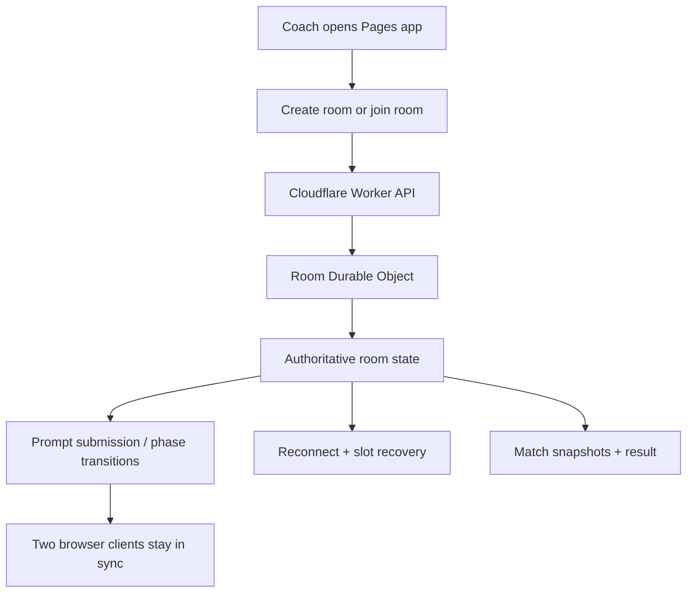

# Plan Cloudflare two-player deployment architecture

## Summary

Move `tactics-master` from a same-device-only prototype to a Cloudflare-hosted two-player web game where one coach creates a room, shares a URL or short PIN, the second coach joins from another device, and both stay synchronized through the full opening-prompt, first-half, halftime, second-half, and result loop.

The architecture should stay cheap and replaceable: static app on Cloudflare Pages, room/session orchestration on a Cloudflare Worker, and per-match live state in a Durable Object so two people can reliably join the same match without introducing full accounts, permanent databases, or bespoke infrastructure too early.

## Problem Frame

The product strategy is still about a quick social football duel, but the issue changes the social surface. The current app assumes one shared device and social secrecy through pass-and-hide. That is good enough for the prototype, but it does not satisfy the next usability step: two people should be able to open a URL, enter a PIN, and play without physically sharing one device.

That shift is bigger than “set up deployment.” Deployment is the enabler, but the real decision is what runtime owns match-room state, prompt secrecy, join flow, and phase synchronization. If those seams are chosen well now, the repo can grow from same-device hot-seat into lightweight two-device play without taking on heavy backend complexity.

## Requirements Traceability

### Carried forward from the tactics duel requirements

- R2. Preserve halftime prompt entry and second-half revision.
- R3. Preserve the short match shape instead of adding lobby friction that makes the game feel heavy.
- R12. Keep behavior legible enough that players can connect prompts to outcomes.
- R15. Preserve a clear result and replay path.

### New requirements from EMM-64

- N1. The game must be deployable on Cloudflare-managed infrastructure.
- N2. Two coaches must be able to reach the game from separate devices through a public URL.
- N3. One coach must be able to create a room and the other must be able to join it with a short PIN or join URL.
- N4. Opening prompts and halftime prompts must remain private to the submitting coach until reveal/play begins.
- N5. Match phase changes must stay synchronized across both connected clients.
- N6. Room state must survive normal page refreshes and short reconnects during an active game.
- N7. The architecture must avoid accounts and permanent user profiles for v1.
- N8. The architecture must be cheap to operate and easy to replace if product shape changes.

## Key Technical Decisions

- KTD1. **Use Cloudflare Pages + Worker + Durable Object as the v1 stack.** Pages serves the Vite app, the Worker exposes room APIs, and one Durable Object owns authoritative state per room.
- KTD2. **Treat a room as the core backend primitive.** A room holds join code, coach slots, prompt submissions, current phase, reconnection tokens, and match snapshots.
- KTD3. **Keep the match engine deterministic and server-authoritative at phase boundaries.** Prompt submission, readiness, kickoff, halftime, and result transitions should be committed by the Durable Object so both clients converge on one source of truth.
- KTD4. **Use short PIN join plus full URL share.** The host sees both a shareable link and a human-friendly PIN; the second coach can use whichever is easier.
- KTD5. **Use ephemeral player sessions instead of accounts.** Each client receives a signed room-scoped token or opaque session id that maps them to `home` or `away` for reconnects and private prompt access.
- KTD6. **Start with durable room metadata, not durable analytics or history.** v1 persistence should cover the live game only. Post-game history, leaderboards, and analytics storage are follow-up work.
- KTD7. **Prefer simple request/response plus live room sync over broad backend abstraction.** A thin frontend API client and a single room state machine are enough now; avoid introducing generic multiplayer infrastructure prematurely.

## High-Level Technical Design



Room lifecycle:

1. Host creates room.
2. Worker allocates Durable Object and short PIN.
3. Host receives join URL and host session token.
4. Second coach joins by PIN or URL and receives away session token.
5. Both clients submit private prompts to the same room object.
6. Durable Object advances the room through first half, halftime, second half, and result.
7. Clients reconnect by token while the room remains active.
8. Room expires automatically after a short TTL once the game ends or is abandoned.

## System-Wide Impact

- The app stops being a purely local state machine in `src/state/gameFlow.ts` and becomes a client over a room-backed session API.
- A new server surface is introduced under `worker/` for room creation, join, prompt submission, synchronization, and replay.
- Prompt secrecy shifts from social convention to backend-enforced access control.
- Deployment moves from GitHub Pages previews as the main target to Cloudflare Pages for the app plus Worker bindings for runtime state.
- Tests must expand from local component flow to room-state and reconnect behavior.

## Output Structure

```text
docs/plans/
worker/
  src/
    index.ts
    room.ts
    roomPin.ts
    roomState.ts
    sessionToken.ts
    routes/
      createRoom.ts
      joinRoom.ts
      submitPrompt.ts
      syncRoom.ts
      replayRoom.ts
  test/
    room.test.ts
    routes.test.ts
src/
  api/
    client.ts
    rooms.ts
  hooks/
    useRoomSession.ts
  state/
    roomFlow.ts
  components/
    RoomEntryScreen.tsx
    LobbyScreen.tsx
    ReconnectBanner.tsx
```

## Implementation Units

### U1. Define the Cloudflare deployment and local-dev baseline

- **Goal:** Introduce the minimal Cloudflare runtime shape the repo will build against.
- **Requirements:** N1, N8.
- **Dependencies:** None.
- **Files:**
  - `package.json`
  - `wrangler.jsonc`
  - `worker/src/index.ts`
  - `worker/tsconfig.json`
  - `README.md`
- **Approach:** Add Wrangler configuration for a Pages + Worker setup, define the Durable Object binding, and document the local/dev/build workflow without overcommitting to extra services.
- **Patterns to follow:** Keep the current Vite frontend intact; add the worker as a parallel runtime rather than rewriting the app shell.
- **Test scenarios:**
  - Worker typechecks with the configured bindings.
  - Local dev can run frontend and worker together.
  - Build output is compatible with Cloudflare Pages deployment.

### U2. Model authoritative room state in a Durable Object

- **Goal:** Create the room state machine that owns match coordination for exactly two coaches.
- **Requirements:** N2, N3, N5, N6, N7.
- **Dependencies:** U1.
- **Files:**
  - `worker/src/room.ts`
  - `worker/src/roomState.ts`
  - `worker/src/roomPin.ts`
  - `worker/test/room.test.ts`
- **Approach:** Define room phases, coach slots, readiness, prompt visibility, reconnect metadata, expiration policy, and replay/reset semantics inside one Durable Object per room.
- **Patterns to follow:** Mirror the existing explicit app phases in `src/state/gameFlow.ts`, but make the room object the authority instead of client-local React state.
- **Test scenarios:**
  - A room accepts exactly two coach slots.
  - Room phase cannot advance until the required prompt submissions exist.
  - Refresh/reconnect preserves the same coach slot during an active room.
  - Expired rooms reject late join attempts cleanly.

### U3. Add Worker routes for create, join, submit, sync, and replay

- **Goal:** Expose a narrow HTTP API between browsers and the room object.
- **Requirements:** N2, N3, N4, N5, N6.
- **Dependencies:** U2.
- **Files:**
  - `worker/src/index.ts`
  - `worker/src/routes/createRoom.ts`
  - `worker/src/routes/joinRoom.ts`
  - `worker/src/routes/submitPrompt.ts`
  - `worker/src/routes/syncRoom.ts`
  - `worker/src/routes/replayRoom.ts`
  - `worker/src/sessionToken.ts`
  - `worker/test/routes.test.ts`
- **Approach:** Keep routes small and room-centric. Each request authenticates via a room-scoped token, forwards to the room Durable Object, and returns only the state visible to that coach.
- **Patterns to follow:** Thin route handlers, most logic in room state methods.
- **Test scenarios:**
  - Create returns room id, PIN, share URL, and host token.
  - Join assigns the second open slot and rejects third-player joins.
  - Prompt submission hides the other coach’s prompt before reveal.
  - Sync returns the correct visible state for home, away, and anonymous clients.

### U4. Move the frontend from local-only flow to room-backed flow

- **Goal:** Replace the current single-device session flow with a room-aware client flow.
- **Requirements:** R2, R3, R15, N2, N3, N5.
- **Dependencies:** U3.
- **Files:**
  - `src/App.tsx`
  - `src/state/roomFlow.ts`
  - `src/api/client.ts`
  - `src/api/rooms.ts`
  - `src/hooks/useRoomSession.ts`
  - `src/components/RoomEntryScreen.tsx`
  - `src/components/LobbyScreen.tsx`
  - `src/components/PromptEntryScreen.tsx`
  - `src/components/ResultScreen.tsx`
  - `src/App.test.tsx`
- **Approach:** Add a host/join entry point, persist the room token client-side, poll or subscribe for room changes, and drive the existing match UI from synchronized room state rather than a wholly local `GameSession`.
- **Patterns to follow:** Reuse the current screen-based phase model where possible so the product feel stays familiar.
- **Test scenarios:**
  - A host can create a room and see a join code.
  - A second coach can join the room and both clients advance together.
  - Refresh restores the coach to the right room and phase.
  - Replay starts a fresh round without requiring a brand-new deployment or account.

### U5. Preserve private prompts and synchronized phase transitions

- **Goal:** Make two-device play feel safe and coherent rather than leaky or race-prone.
- **Requirements:** R12, N4, N5, N6.
- **Dependencies:** U3, U4.
- **Files:**
  - `worker/src/room.ts`
  - `worker/src/sessionToken.ts`
  - `src/hooks/useRoomSession.ts`
  - `src/components/HalftimeScreen.tsx`
  - `src/components/ReconnectBanner.tsx`
  - `src/test/acceptance/tacticsDuel.acceptance.test.ts`
- **Approach:** Gate prompt visibility by coach identity, make phase advancement idempotent, and add reconnect/status UI so transient disconnects do not create confusion during the match.
- **Patterns to follow:** Preserve the current “bounded phase changes” model instead of introducing freeform real-time simulation sync.
- **Test scenarios:**
  - A coach never sees the opponent’s unrevealed prompt.
  - Duplicate submit or refresh actions do not corrupt room phase.
  - A reconnecting client resynchronizes without losing side assignment.
  - Halftime works the same way as opening prompt entry, but against the shared room.

### U6. Document operations, environment, and deployment checks

- **Goal:** Make the Cloudflare architecture runnable by a human without hidden setup knowledge.
- **Requirements:** N1, N8.
- **Dependencies:** U1 through U5.
- **Files:**
  - `README.md`
  - `docs/testing/cloudflare-room-checklist.md`
- **Approach:** Document required bindings, local dev commands, deployment steps, TTL expectations, and a manual two-browser smoke checklist.
- **Patterns to follow:** Match the repo’s existing concise verification style.
- **Test scenarios:**
  - A contributor can follow the docs to run a local two-browser room test.
  - A contributor can identify required Cloudflare secrets and bindings without reading code.
  - Manual smoke steps cover create, join, prompts, halftime, reconnect, and replay.

## Sequencing

1. U1 establishes the Cloudflare runtime contract.
2. U2 creates the authoritative room model.
3. U3 exposes the browser-facing API.
4. U4 migrates the frontend onto that API.
5. U5 hardens privacy, idempotency, and reconnect behavior.
6. U6 documents setup and smoke verification.

## Scope Boundaries

### Deferred to follow-up work

- Spectators beyond the two coaches.
- Permanent match history, analytics storage, or leaderboards.
- Accounts, friends lists, or identity beyond room-scoped sessions.
- Native mobile wrappers or push notifications.
- Rich real-time transport upgrades if polling is good enough for v1.

### Outside this plan

- Rewriting the football engine.
- Large UI redesign unrelated to room creation and join.
- Remote matchmaking or public room discovery.
- Anti-cheat measures beyond basic room-token privacy and slot control.

## Risks and Mitigations

- **Risk:** Durable Object state model grows too broad.
  - **Mitigation:** Keep the object focused on room/session orchestration, not analytics or generic backend concerns.
- **Risk:** Prompt secrecy leaks through overly broad sync responses.
  - **Mitigation:** Shape sync responses per coach identity and test visible-state filtering directly.
- **Risk:** Reconnect and duplicate submits create inconsistent room phases.
  - **Mitigation:** Make room transitions idempotent and key them off authoritative room state, not client optimism.
- **Risk:** Cloudflare-specific wiring overwhelms a still-forming repo.
  - **Mitigation:** Add only Pages, Worker, and Durable Object seams now; defer extra services.
- **Risk:** Two-device support adds too much latency or friction.
  - **Mitigation:** Keep lobby and join flow minimal, and continue using bounded phase transitions rather than high-frequency multiplayer sync.

## Verification Strategy

- Worker unit tests for room state, slot assignment, phase progression, privacy filtering, and expiration behavior.
- Frontend tests for host/join flow, reconnect restoration, and replay path.
- Manual two-browser smoke run covering create room, join by PIN, private prompt entry, halftime, reconnect, and replay.
- Cloudflare local-dev verification that the Pages app and Worker bindings run together before production deploy.

## Assumptions

- A short numeric or alphanumeric PIN is sufficient for v1 room joining.
- Polling-based sync is acceptable unless implementation proves it too slow or too expensive.
- Room TTL can be short-lived because the target session is a single quick match, not a long-lived ongoing league.
